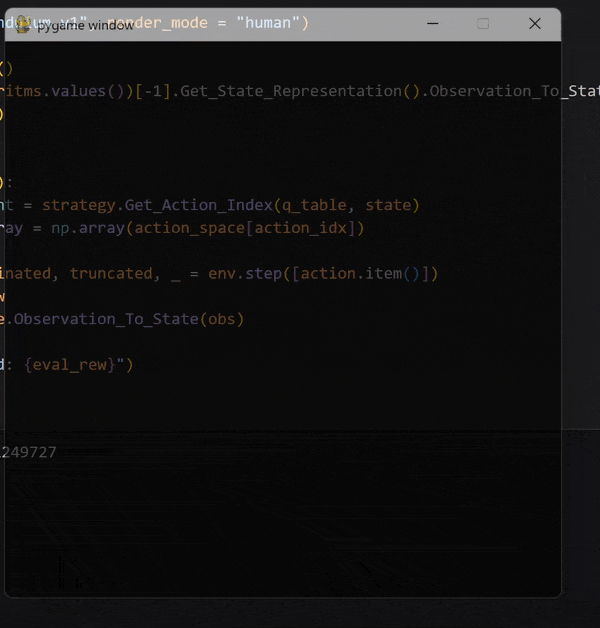
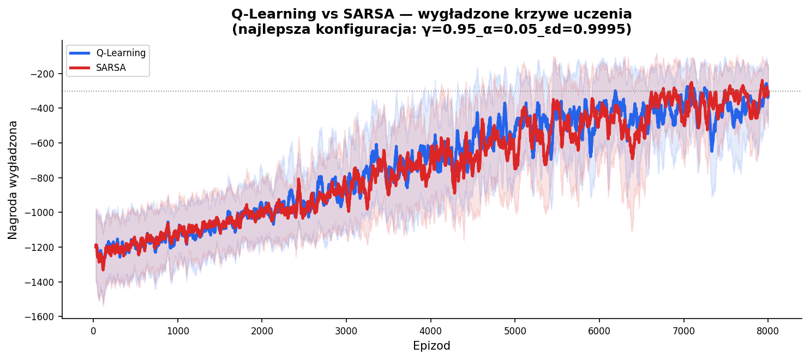

# Inverted Pendulum Control: Reinforcement Learning approach
A reinforcement  learning framework for gymnasium  environments. Allows for flexible reconfiguration of modules like: update policy, state representation, and strategy. Showcased on the [inverted pendulum environment](https://gymnasium.farama.org/environments/classic_control/pendulum/) from Gymnasium.

Authors: Selim Mucharski, Arkadiusz Rozmarynowicz

Development time: from 04.2026 to 06.2026

## Table of contents
* [General information](#general-information)
* [Visualization](#visualization)
* [Outcome](#outcome)
* [Technologies used](#technologies-used)
* [Setup](#setup)

## General information
 - Implemented:
    - Q-Learning and SARSA algorithms,
    - epsilon-greedy strategy,
    - Q-table with state discretization.
- Allowed for combining various algorithms, strategies, and state representations in a flexible way.
- Trained models on the inverted pendulum control problem.
- Tested and analyzed parameters' impact on effectiveness:
    - discount factor,
    - learning rate,
    - epsilon decay,
    - action space size,
    - observation space size.

## Visualization
Below you can see a GIF showing a pendulum controlled by a trained Q-Learning model:

 
<em>Figure 2: Q-Learning model controlling the pendulum.</em>

A quick presentation of the training process, along with a few more examples, can be seen in [this YouTube video](https://www.youtube.com/watch?v=yqmj4zeWN_Q).

## Outcome
Having compared Q-Learning's and SARSA's effectiveness in regard to parameters (learning rate, discount factor, epsilon decay), their outcomes are rather similar in this environment. Figure 1 shows how rewards change with respect to episodes passed, for the best parameter configuration:

learning rate (alpha) = 0.05  
discount factor (gamma) = 0.95  
epsilon decay (ϵd) = 0.9995  
total number of episodes = 8000  

 
<em>Figure 1: Q-Learning vs SARSA:   The lines in the background are rewards over episodes during training.   The dimmer lines in the front are rewards over episodes, smoothed over 50 steps.</em>

We see that both algorithms performed well.

The most surprising observation was that the best size of action space was 3, where the models could only push the pendulum left with max force, push it right with max force, or do nothing at all.

For the purpose of the project, a more in-depth analysis of theparameters' impact was conducted; however, we have decided not to share it here.

## Technologies used
- Python
- numpy
- pandas

## Project structure
- main.ipynb file contains an example use of the framework: pendulum control training.
- Base_Modules/RL_Algorithms.py contains the base class that, using composition, manages other modules listed below
- Base_Modules/Updaters.py contains Q-Learning and SARSA algorithms classes.
- Base_Modules/Strategies.py contains strategy modules like epsilon-greedy, greedy, etc.
- Base_Modules/State_Representations.py contains modules for state discretization and representation: in this example, it is a Q-table.

## Setup

Create python3 virtual environment:
> python3 -m venv .venv

Install packages:
> pip install -r requirements.txt